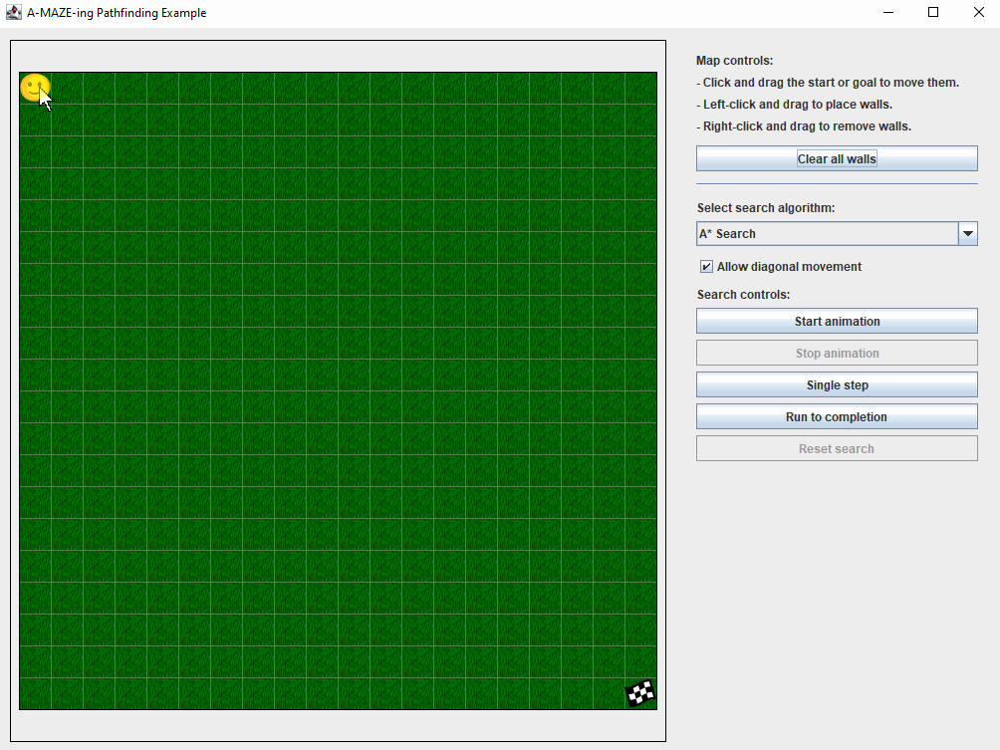

# An a-MAZE-ing Java pathfinding example

This simple program allows the user to visualize how different graph search algorithms can be used for pathfinding in mazes / games / GPS applications.

The algorithms are:
- Breadth-First Search
- Dijkstra (Uniform Cost Search)
- Greedy Best First Search
- A* Search

## Program usage
Usage of the program is as follows:

### Editing the maze
To edit the maze:
- Left-click and drag the starting point (emoji) and goal point (checkered flag) to move them.
- Left-click and drag to place walls.
- Right-click and drag to remove walls.
- Click the "Clear walls" button to reset the maze completely.

### Running the search
To run a search:
- Select the search algorithm from the drop-down list.
- Choose whether or not diagonal movement is allowed using the checkbox.
- To start the search animation running, click the "Start" button.
- To stop it, click the "Stop" button.
- Rather than playing an animation, you may move through the algorithm one step at a time using the "Step" button.
- If you'd like to jump to the end, click the "Run to completion" button.
- To reset the search, or clear it once it's done, click the "Reset search" button.

An exampe showing program usage is shown here:

## Code organization
The code is organized using good Java / Object-Oriented programming conventions.

### Model-View-Controller (MVC)
The [`IGraphSearchAlgorithm`](./src/ictgradschool/amazeing/algorithms/IGraphSearchAlgorithm.java) implementations, and the [`Maze`](./src/ictgradschool/amazeing/maze/Maze.java),  maintain lists of listeners ([`IAlgorithmListener`](./src/ictgradschool/amazeing/algorithms/IAlgorithmListener.java) and [`IMazeListener`](./src/ictgradschool/amazeing/maze/IMazeListener.java), respectively). Whenever the programState of instances of these classes changes, those listeners will be notified about the changes.

In this project, the [`MazePanel`](./src/ictgradschool/amazeing/gui/MazePanel.java) listens for these changes, so that it may `repaint()` itself when necessary.

### Polymorphism
Several different search algorithms are implemented, which are all implementations of the `IGraphSearchAlgorithm` interface. Outside of the [`algorithms`](./src/ictgradschool/amazeing/algorithms) package, the rest of the program does not care about the specifics of the search algorithm being used - only that an instance of `IGraphSearchAlgorithm` is supplied. This allows us to easily add more algorithms later, should we choose to do so.

### Reducing code duplication
The four algorithms share a lot of code in common. In particular, [`GreedyBestFirstSearch`](./src/ictgradschool/amazeing/algorithms/GreedyBestFirstSearch.java) shares a lot in common with [`BreadthFirstSearch`](./src/ictgradschool/amazeing/algorithms/BreadthFirstSearch.java), while [`AStarSearch`](./src/ictgradschool/amazeing/algorithms/AStarSearch.java) shares a lot in common with [`DijkstraSearch`](./src/ictgradschool/amazeing/algorithms/DijkstraSearch.java).

As such, inheritance has been used appropriately to reduce code duplication. `AStarSearch` extends `DijkstraSearch`, while `GreedyBestFirstSearch` extends `BreadthFirstSearch`. Both `DijkstraSearch` and `BreadthFirstSearch` further extend the abstract class [`AbstractSearchAlgorithm`](./src/ictgradschool/amazeing/algorithms/AbstractSearchAlgorithm.java).

### Separation of concerns
The graphing and searching functionality is separated from the maze functionality completely. This way, the graphing / searching code could be reused in another project without worrying about dependencies on the maze / gui code.

## Algorithms
The algorithms implemented are as follows:

- **Breadth-First Search (BFS)**: One of the most basic graph search algorithms. Searches in all directions equally, expanding all nodes at the same level before moving deeper. The version implemented here does not take into account the cost to reach any particular node.

- **Dijkstra (Uniform Cost Search)**: An extension of BFS which keeps track of the total cost to reach each node explored by the algorithm. When expanding, Dijkstra will prefer to expand to nodes with lower costs from the start node to the node in question. If Dijkstra's algorithm finds a path from the start to the goal node, that path is guaranteed to be the lowest-cost path.

- **Greedy Best-First Search (GBFS)**: An extension of BFS which, when expanding nodes, will use a *heuristic* to estimate the cost from the node being expanded to the goal node. The algorithm will prefer to expand to nodes with lower estimated costs to reach the goal. In this implementation, the heuristic used is the *straight-line distance* between the two nodes. This algorithm often performs faster than BFS or Dijkstra, but is not guaranteed to find the shortest path.

- **A Star**: Like Dijkstra, this algorithm keeps track of the total cost to reach the current node, from the start node (let's all it `c`). And, like GBFS, it also uses a heuristic to estimate the cost to reach the goal from the current node (let's call it `h`). When expanding, A-Star prefers to expand to nodes with lower `c + h` values. As long as the heuristic used doesn't overestimate the cost to reach the goal from any particular node, then A-Star, like Dijkstra, is also guaranteed to find the lowest-cost path. And, it will often be able to accomplish this while exploring fewer nodes in total than Dijkstra (hence, it is often faster).

For more information on these algorithms, along with more interactive demos, see [this excellent article](https://www.redblobgames.com/pathfinding/a-star/introduction.html) from Red Blob Games.